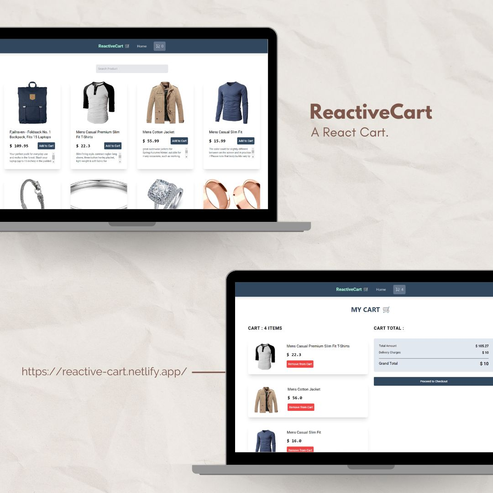

# ReactiveCart 🛒 : A React Card made with React and Vite.

>API Used: Fakestore https://fakestoreapi.com/

<br>

## Tools used:


 


## Features: 
    1. Products and description.
    2. ContextAPI for state management.
    3. Add to cart functionality.
    4. Product Search.
    5. Empty cart redirect to shopping.
    6. Skeleton Loading.
    7. Responsive

<br>

## Live Link: 
>https://reactive-cart.netlify.app/

<br>

## Overview:

<br>

## To Run Locally:

1. Clone the project 
````
git clone https://github.com/aryanamdev/reactive-cart
````
2. Install Dependencies
````
npm install
````
3. Start local server
````
npm run dev
````
